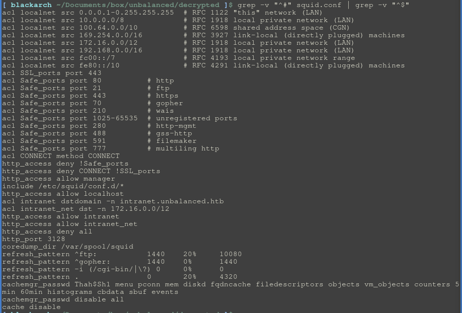

# Try to find squid.conf first. (mainly /etc/squid/squid.conf)

## Example of conf explained




1. The proxy is configured to allow connections only on the specified Safe_ports, everything else will be rejected (http access deny !Safe_ports)
2. The proxy allows access to a domain name (http_access allow intranet)
3. The proxy allows connections towards a subnet (http_access allow intranet_net)
4. The proxy has a managing interface that allows an authenticated user access to statistics of the cache manager
(cachemgr_passwd ...)
- So here, edit the config of the firefox proxy, add the ip and port of the proxy inside, and visit the domain.


## Cachemgr

- If you saw cachemgr in the config file, the proxy has a managing interface used by IT operators to view some statistics about its cache manager via a command line tool called squidclient.

- Squidclient needs valid credentials to connect to the cache manager. 

- ```squidclient -U webmaster -W 'password' -h <ip> mgr:menu```
- then use the available commands at your disposal