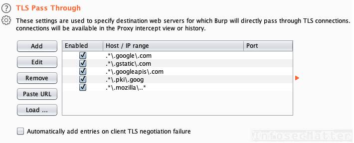

## Useful extensions

Autorize – To test BACs (Broken Access Control)
Burp Bounty – Profile-based scanner
Active Scan++ – Add more power to Burp’s Active Scanner
AuthMatrix – Authorization/PrivEsc checks
Broken Link Hijacking – For BLH (Broken Link Hijacking)
Collaborator Everywhere – Pingback/SSRF (Server-Side Request Forgery)
Command Injection Attacker
Content-Type Converter – Trying to bypass certain restrictions by changing Content-Type
Decoder Improved – More decoder features
Freddy – Deserialization
Flow – Better HTTP history
Hackvertor – Handy type conversion
HTTP Request Smuggler
Hunt – Potential vuln identifier
InQL – GraphQL Introspection testing
J2EE Scan – Scanning J2EE apps
JSON/JS Beautifier
JSON Web Token Attacker
ParamMiner – Mine hidden parameters
Reflected File Download Checker
Reflected Parameter – Potential reflection
SAML Raider – SAML testing
Upload Scanner – File upload tester
Web Cache Deception Scanner

---

## Less noise in burp


```
.*\.google\.com
.*\.gstatic\.com
.*\.googleapis\.com
.*\.pki\.goog
.*\.mozilla\..*
```

---


## Find IDORs with Autorize and Auto Reapeater

- Authenticate with 2 different accounts in two browsers

### Authorize

- For each request, it will send an equal request with something changed. We can automate the process to find IDORs or Access Control issues.
- Copy all the cookies of one of the user (the least privileges)
- Paste in Authorize extensions
- Add filter : **Scope Items only** / **Ignore js css png...** / **Ignore spider requests**.
- Click on Autorize is on and that's it.
- Browse the entire website and check some times if you have ```Is enforced??``` and audit the request.
- When you have checked something, go to the ```Proxy```, select in the ```HTTP history``` the checked parts, and mark it out of score, then ```Clear List``` in Authorize.

### Autorepeater

- Used when you have UUIDs to automate the process of check and replace. (org UUID, user UUID ...).
- Can be combinated with authorize.
- Click on ```Add```
- ```Request String```
- Replace the UUID by another one
- ```Replace All```
- ```Active AutoRepeater```
- To have a better view, we will change the color of the 200 modified request :
1. ```Log Highlighter```
2. ```Green```
3. ```Or```
4. ```Modified```
5. ```Status Code```
6. ```Equal to```
7. ```200```

- Add your own (False to True, User to Admin, Content type XML to JSON ...)


