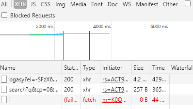

# Dev tools 

- Start by right clicking, inspect (or CTRL + SHIFT + I)

---

## Sources

- You have the tree structure of the current page 

---

## Network

- Reload the page, check the url you are visiting, and you will see the request and response

### JS files

- First of all : Refresh
**Beautify it:**
- Right click on a javascript file, open in sources panel
- Click on the bracket to have something beautified ("pretty print")


**XHR:**  
- Fetching remote files with javascript (XMLHttpRequest)
- If you click on an initiator in XHR, you'll be redirected on the line of the code which is responsible of this request
- Try to search for  ```/api, /v1, /yql``` ...



- Open Dev Tools
- In Sources > Search the little menu ```Event Listeners```


- Search the event you want to trigger and try to put some breakpoints in the code to see how it works.

---

## Console

- Execute javascript code here when you can.

