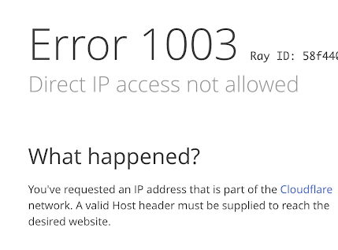

## Theory

Cloudflare is a security layer that protect a website. It works as a middleman between a server and users. It protect against web-based attacks such as XSS and SQLi Injections, Buffer Overflow and most significantly, DDoS attacks. In general, an attacker can't access origin server directly if cloudflare is enabled. So, it could be difficult to deploy such attacks.

---

## Recon

From "A" records of the IP of the target, we can get the server IP.
Two options : 
- https://toolbox.googleapps.com/apps/dig/#A/
- `dig <target>`

- Then visit one of this IP :

- or use dorks on censys.io search : 
`parsed.names: <target>`

- to check if it's behind CloudFlare.

- Now we have multiple IPs from Censys, but which one is the origin server ?

## First way

- Tool CloudFlair helps to get the origin server and it matches HTML identical contents to the main domain to determine the origin IP.
https://github.com/christophetd/CloudFlair

- `python cloudflair.py <target>`

